# Architecture Diagrams for Twitch and Repos Documentation

This file contains the Mermaid diagrams for:
1. Global System Architecture (essential + semi-essential)
2. Domain Interaction Diagram (5 core domains)
3. Non-Essential & Disconnected Overview

## 1. Global System Architecture (Essential + Semi-Essential)

```mermaid
graph TB
    %% Main Platform Categories
    subgraph "Essential Core Components"
        CHAT["💬 Chat System<br/>(151 services)"]
        VIDEO["🎥 Video Platform<br/>(512 services)"]
        WEB["🌐 Web Interface<br/>(146 services)"]
        COMMERCE["💰 Commerce<br/>(118 services)"]
        IDENTITY["👤 Identity<br/>(76 services)"]
    end
    
    subgraph "Semi-Essential Services"
        DISCOVERY["🔍 Discovery<br/>(117+ services)"]
        SECURITY["🔒 Security<br/>(130+ services)"]
        CONTENT["📄 Content<br/>(100+ services)"]
        EVENTBUS["📢 EventBus<br/>(Event Distribution)"]
        ANALYTICS["📊 Analytics<br/>(80+ services)"]
    end
    
    subgraph "Repository Ecosystem"
        subgraph "Rust Components (18)"
            RUSTCHAT["Chat Services<br/>(8 repos)"]
            RUSTPUBSUB["PubSub Infrastructure<br/>(5 repos)"]
            RUSTEDGE["Edge Services<br/>(2 repos)"]
            RUSTUTIL["Utilities<br/>(3 repos)"]
        end
        
        subgraph "TypeScript Components (8)"
            TSFRONTEND["Frontend Apps<br/>(3 repos)"]
            TSCHAT["Chat Services<br/>(4 repos)"]
            TSLIBS["Core Libraries<br/>(1 repo)"]
        end
    end
    
    %% Core Domain Relationships
    WEB --> CHAT
    WEB --> VIDEO
    WEB --> COMMERCE
    WEB --> IDENTITY
    CHAT --> IDENTITY
    VIDEO --> IDENTITY
    COMMERCE --> IDENTITY
    DISCOVERY --> VIDEO
    DISCOVERY --> CONTENT
    SECURITY --> CHAT
    SECURITY --> VIDEO
    SECURITY --> IDENTITY
    EVENTBUS -.-> CHAT
    EVENTBUS -.-> VIDEO
    ANALYTICS -.-> VIDEO
    ANALYTICS -.-> COMMERCE
    CONTENT -.-> VIDEO
    
    %% Repository to Platform Integration
    RUSTCHAT -.-> CHAT
    RUSTPUBSUB -.-> CHAT
    RUSTPUBSUB -.-> EVENTBUS
    RUSTEDGE -.-> CHAT
    TSFRONTEND -.-> WEB
    TSCHAT -.-> CHAT
    TSLIBS -.-> CHAT
    
    %% Repository Relationships
    TSLIBS --> TSCHAT
    TSLIBS --> TSFRONTEND
    RUSTPUBSUB --> RUSTCHAT
    RUSTUTIL --> RUSTCHAT
    RUSTUTIL --> RUSTPUBSUB
    
    %% Styling
    classDef essential fill:#e1f5fe,stroke:#01579b,stroke-width:2px
    classDef semiessential fill:#e8f5e9,stroke:#1b5e20,stroke-width:2px
    classDef rustComponent fill:#fff3e0,stroke:#e65100,stroke-width:2px
    classDef tsComponent fill:#f3e5f5,stroke:#4a148c,stroke-width:2px
    
    class CHAT,VIDEO,WEB,COMMERCE,IDENTITY essential
    class DISCOVERY,SECURITY,CONTENT,EVENTBUS,ANALYTICS semiessential
    class RUSTCHAT,RUSTPUBSUB,RUSTEDGE,RUSTUTIL rustComponent
    class TSFRONTEND,TSCHAT,TSLIBS tsComponent
```



## 2. Domain Interaction Diagram (5 Core Domains)

```mermaid
flowchart TB
    %% Core Domains
    CHAT["💬 Chat Domain<br/>(151 services)"]
    VIDEO["🎥 Video Domain<br/>(512 services)"]
    WEB["🌐 Web Domain<br/>(146 services)"]
    COMMERCE["💰 Commerce Domain<br/>(118 services)"]
    IDENTITY["👤 Identity Domain<br/>(76 services)"]

    %% Key Sub-Components
    subgraph "Chat Domain Components"
        CHAT_TMI["TMI<br/>(Twitch Messaging)"]
        CHAT_PUBSUB["PubSub<br/>(Event Distribution)"]
        CHAT_MOD["Moderation<br/>(AutoMod, Classifier)"]
        CHAT_ROOMS["Chat Rooms<br/>(State Management)"]
    end
    
    subgraph "Video Domain Components"
        VIDEO_INGEST["Stream Ingestion<br/>(GoIngest)"]
        VIDEO_TRANS["Transcoding<br/>(Transcoder, Transwarp)"]
        VIDEO_CDN["Content Delivery<br/>(Weaver, Usher)"]
        VIDEO_STORAGE["Storage<br/>(S3Proxy, VOD)"]
    end
    
    subgraph "Web Domain Components"
        WEB_EMBER["Ember.js Frontend<br/>(Web Client)"]
        WEB_API["API Integration<br/>(API Proxy)"]
        WEB_AUTH["Authentication<br/>(Auth Services)"]
        WEB_UI["UI Components<br/>(Ember Components)"]
    end
    
    subgraph "Commerce Domain Components"
        COMMERCE_PAY["Payment Processing"]
        COMMERCE_SUB["Subscription Services"]
        COMMERCE_BITS["Bits & Virtual Goods"]
        COMMERCE_ADS["Advertising Systems"]
    end
    
    subgraph "Identity Domain Components"
        IDENTITY_AUTH["Authentication"]
        IDENTITY_PERM["Permissions & Roles"]
        IDENTITY_PROFILE["User Profiles"]
        IDENTITY_SOCIAL["Social Connections"]
    end
    
    %% Main Domain Interactions
    WEB --> CHAT: "Embeds chat<br/>Displays messages"
    WEB --> VIDEO: "Embeds player<br/>Streams content"
    WEB --> COMMERCE: "Manages transactions<br/>Displays subscriptions"
    WEB --> IDENTITY: "Authenticates users<br/>Shows profiles"
    
    CHAT --> IDENTITY: "Validates users<br/>Checks permissions"
    VIDEO --> IDENTITY: "Verifies stream rights<br/>Content restrictions"
    COMMERCE --> IDENTITY: "Payment verification<br/>Account linking"
    
    VIDEO --> CHAT: "Stream events<br/>Clip sharing"
    COMMERCE --> VIDEO: "Ad insertion<br/>Premium content"
    
    %% Sub-Component Connections
    CHAT_TMI <--> CHAT_PUBSUB: "Message distribution"
    CHAT_TMI --> CHAT_MOD: "Content filtering"
    CHAT_PUBSUB --> CHAT_ROOMS: "Room updates"
    
    VIDEO_INGEST --> VIDEO_TRANS: "Raw streams"
    VIDEO_TRANS --> VIDEO_CDN: "Processed streams"
    VIDEO_TRANS --> VIDEO_STORAGE: "VOD archiving"
    VIDEO_CDN --> VIDEO_STORAGE: "Content serving"
    
    WEB_API <--> WEB_EMBER: "Data exchange"
    WEB_AUTH <--> WEB_EMBER: "Session management"
    WEB_UI <--> WEB_EMBER: "Component integration"
    
    COMMERCE_PAY <--> COMMERCE_SUB: "Payment processing"
    COMMERCE_BITS <--> COMMERCE_PAY: "Virtual currency"
    COMMERCE_ADS <--> COMMERCE_SUB: "Ad-free benefits"
    
    IDENTITY_AUTH <--> IDENTITY_PERM: "Permission verification"
    IDENTITY_PROFILE <--> IDENTITY_AUTH: "Account validation"
    IDENTITY_SOCIAL <--> IDENTITY_PROFILE: "Friend connections"
    
    %% Styling
    classDef chatColor fill:#e1f5fe,stroke:#01579b,stroke-width:2px
    classDef videoColor fill:#fff3e0,stroke:#e65100,stroke-width:2px
    classDef webColor fill:#f3e5f5,stroke:#4a148c,stroke-width:2px
    classDef commerceColor fill:#e8f5e9,stroke:#1b5e20,stroke-width:2px
    classDef identityColor fill:#fce4ec,stroke:#880e4f,stroke-width:2px
    
    class CHAT,CHAT_TMI,CHAT_PUBSUB,CHAT_MOD,CHAT_ROOMS chatColor
    class VIDEO,VIDEO_INGEST,VIDEO_TRANS,VIDEO_CDN,VIDEO_STORAGE videoColor
    class WEB,WEB_EMBER,WEB_API,WEB_AUTH,WEB_UI webColor
    class COMMERCE,COMMERCE_PAY,COMMERCE_SUB,COMMERCE_BITS,COMMERCE_ADS commerceColor
    class IDENTITY,IDENTITY_AUTH,IDENTITY_PERM,IDENTITY_PROFILE,IDENTITY_SOCIAL identityColor
```

## 3. Non-Essential & Disconnected Overview

```mermaid
graph TB
    %% Main Categories
    ESSENTIAL["Essential Core<br/>(5 domains, 1003+ services)"]
    SEMI["Semi-Essential<br/>(4 domains, 427+ services)"]
    
    subgraph "Non-Essential Components"
        DEV["Developer Tools<br/>(7 services)"]
        ANALYTICS["Analytics & Data<br/>(7 services)"]
        UI["UI & Frontend<br/>(3 services)"]
        INTEGRATION["Integration Services<br/>(5 services)"]
        CONTENT["Content & Creative<br/>(7 services)"]
        COMMUNITY["Community & Safety<br/>(5 services)"]
        SUPPORT["Support & Operations<br/>(7 services)"]
        SPECIAL["Specialized Services<br/>(39 services)"]
        MONITORING["Monitoring & Infrastructure<br/>(1 service)"]
        TEAMS["Team Directories<br/>(32 directories)"]
        MISC["Miscellaneous<br/>(5 folders)"]
    end
    
    subgraph "Disconnected Components"
        DISC_COMP["Disconnected Components<br/>(43 items)"]
        DISC_SERV["Disconnected Services<br/>(4 services)"]
        
        subgraph "Disconnected Categories"
            UTILITY["Utility Components<br/>(Build, Config, Docs)"]
            ABBREV["Abbreviated Components<br/>(3-4 letter codes)"]
            PLACEHOLDER["Placeholder Files<br/>(README, CHANGELOG)"]
            TEST["Test Directories<br/>(test, benches)"]
        end
    end
    
    %% Main Category Connections
    ESSENTIAL --> SEMI: "Partial dependency"
    SEMI --> DEV: "Uses for development"
    SEMI --> ANALYTICS: "Provides data to"
    SEMI --> CONTENT: "Manages content for"
    SEMI --> COMMUNITY: "Safety integration"
    
    DEV --> TEAMS: "Organized by"
    SUPPORT --> TEAMS: "Organized by"
    MONITORING --> SUPPORT: "Used by"
    
    %% Disconnected Components
    DISC_COMP --> UTILITY: "Includes"
    DISC_COMP --> ABBREV: "Includes"
    DISC_COMP --> PLACEHOLDER: "Includes"
    DISC_COMP --> TEST: "Includes"
    
    %% Limited connections to main system
    ESSENTIAL -.-> DISC_SERV: "Historical connection"
    DISC_COMP -.-> MISC: "Some overlap"
    
    %% Styling
    classDef essentialStyle fill:#e1f5fe,stroke:#01579b,stroke-width:2px
    classDef semiStyle fill:#e8f5e9,stroke:#1b5e20,stroke-width:2px
    classDef supportStyle fill:#fff3e0,stroke:#e65100,stroke-width:2px
    classDef disconnectedStyle fill:#f5f5f5,stroke:#757575,stroke-width:2px,stroke-dasharray: 5 5
    
    class ESSENTIAL essentialStyle
    class SEMI semiStyle
    class DEV,ANALYTICS,UI,INTEGRATION,CONTENT,COMMUNITY,SUPPORT,SPECIAL,MONITORING,TEAMS,MISC supportStyle
    class DISC_COMP,DISC_SERV,UTILITY,ABBREV,PLACEHOLDER,TEST disconnectedStyle
```

These diagrams provide a comprehensive visualization of the system architecture, showing the relationships between the essential, semi-essential, and non-essential components, as well as the interactions between the core domains.
