# Rust Components Coverage

[[../Twitch Docs/Index]] | [[../typescript-components/Coverage]] | [[../Changelog]]

## Overview
Documentation coverage for Rust-based repositories in the Surrentumlabs ecosystem. This covers 18 Rust component repositories with various completion statuses.

## Component Checklist

| Component | Type | Source Path | Status | Last Scanned | Doc File | Backlinks |
|-----------|------|-------------|--------|--------------|----------|-----------|
| chat-gui-rust | repo | /home/cinder/Documents/repos/Surrentumlabs/Rust Component Repos/chat-gui-rust | todo | 2025-01-26 | - | [[../Twitch Docs/Index]] |
| chat-parser-rust | repo | /home/cinder/Documents/repos/Surrentumlabs/Rust Component Repos/chat-parser-rust | todo | 2025-01-26 | - | [[../Twitch Docs/Index]] |
| chat-rust | repo | /home/cinder/Documents/repos/Surrentumlabs/Rust Component Repos/chat-rust | todo | 2025-01-26 | - | [[../Twitch Docs/Index]] |
| chatrooms-rust | repo | /home/cinder/Documents/repos/Surrentumlabs/Rust Component Repos/chatrooms-rust | todo | 2025-01-26 | - | [[../Twitch Docs/Index]] |
| classifier-rust | repo | /home/cinder/Documents/repos/Surrentumlabs/Rust Component Repos/classifier-rust | todo | 2025-01-26 | - | [[../Twitch Docs/Index]] |
| dggchat-rust | repo | /home/cinder/Documents/repos/Surrentumlabs/Rust Component Repos/dggchat-rust | todo | 2025-01-26 | - | [[../Twitch Docs/Index]] |
| modbot-rust | repo | /home/cinder/Documents/repos/Surrentumlabs/Rust Component Repos/modbot-rust | todo | 2025-01-26 | - | [[../Twitch Docs/Index]] |
| overrustlelogs-rust | repo | /home/cinder/Documents/repos/Surrentumlabs/Rust Component Repos/overrustlelogs-rust | todo | 2025-01-26 | - | [[../Twitch Docs/Index]] |
| protobuf-rust | repo | /home/cinder/Documents/repos/Surrentumlabs/Rust Component Repos/protobuf-rust | todo | 2025-01-26 | - | [[../Twitch Docs/Index]] |
| psub-broker-rust | repo | /home/cinder/Documents/repos/Surrentumlabs/Rust Component Repos/psub-broker-rust | todo | 2025-01-26 | - | [[../Twitch Docs/Index]] |
| pubsub-control-edge | repo | /home/cinder/Documents/repos/Surrentumlabs/Rust Component Repos/pubsub-control-edge | todo | 2025-01-26 | - | [[../Twitch Docs/Index]] |
| pubsub-control-rust | repo | /home/cinder/Documents/repos/Surrentumlabs/Rust Component Repos/pubsub-control-rust | todo | 2025-01-26 | - | [[../Twitch Docs/Index]] |
| pubsub-load-generator-rust | repo | /home/cinder/Documents/repos/Surrentumlabs/Rust Component Repos/pubsub-load-generator-rust | todo | 2025-01-26 | - | [[../Twitch Docs/Index]] |
| pubsub-rust | repo | /home/cinder/Documents/repos/Surrentumlabs/Rust Component Repos/pubsub-rust | todo | 2025-01-26 | - | [[../Twitch Docs/Index]] |
| tmi-http-edge-rust | repo | /home/cinder/Documents/repos/Surrentumlabs/Rust Component Repos/tmi-http-edge-rust | todo | 2025-01-26 | - | [[../Twitch Docs/Index]] |
| tsgg-rust | repo | /home/cinder/Documents/repos/Surrentumlabs/Rust Component Repos/tsgg-rust | todo | 2025-01-26 | - | [[../Twitch Docs/Index]] |
| uri-extract | repo | /home/cinder/Documents/repos/Surrentumlabs/Rust Component Repos/uri-extract | todo | 2025-01-26 | - | [[../Twitch Docs/Index]] |
| whispers-rust | repo | /home/cinder/Documents/repos/Surrentumlabs/Rust Component Repos/whispers-rust | todo | 2025-01-26 | - | [[../Twitch Docs/Index]] |

## Rust Dependency Matrix

```mermaid
graph TB
    subgraph "Chat Services"
        ChatGUI[chat-gui-rust]
        ChatParser[chat-parser-rust] 
        ChatRust[chat-rust]
        Chatrooms[chatrooms-rust]
        DGGChat[dggchat-rust]
        Classifier[classifier-rust]
        ModBot[modbot-rust]
        Whispers[whispers-rust]
    end
    
    subgraph "PubSub Infrastructure"
        PubSubRust[pubsub-rust]
        PubSubBroker[psub-broker-rust]
        PubSubControl[pubsub-control-rust]
        PubSubEdge[pubsub-control-edge]
        PubSubGenerator[pubsub-load-generator-rust]
    end
    
    subgraph "Edge Services"
        TMIEdge[tmi-http-edge-rust]
        OverrustleLogs[overrustlelogs-rust]
    end
    
    subgraph "Utilities"
        Protobuf[protobuf-rust]
        URIExtract[uri-extract]
        TSGG[tsgg-rust]
    end
    
    %% Dependencies
    ChatGUI --> PubSubRust
    ChatRust --> PubSubRust
    Chatrooms --> PubSubRust
    DGGChat --> PubSubRust
    ModBot --> ChatParser
    ModBot --> Classifier
    Whispers --> PubSubRust
    
    PubSubBroker --> PubSubControl
    PubSubEdge --> PubSubControl
    PubSubGenerator --> PubSubRust
    
    TMIEdge --> ChatParser
    OverrustleLogs --> ChatParser
    
    TSGG --> ChatParser
    URIExtract --> Protobuf
    
    %% Styling
    classDef chatService fill:#f9d71c,stroke:#333,stroke-width:2px
    classDef pubsubService fill:#ff6b6b,stroke:#333,stroke-width:2px
    classDef edgeService fill:#51cf66,stroke:#333,stroke-width:2px
    classDef utilityService fill:#74c0fc,stroke:#333,stroke-width:2px
    
    class ChatGUI,ChatParser,ChatRust,Chatrooms,DGGChat,Classifier,ModBot,Whispers chatService
    class PubSubRust,PubSubBroker,PubSubControl,PubSubEdge,PubSubGenerator pubsubService
    class TMIEdge,OverrustleLogs edgeService
    class Protobuf,URIExtract,TSGG utilityService
```

## Summary
- **Total Rust Repositories**: 18
- **Documentation Status**: All todo (0% complete)
- **Primary Categories**: Chat Services (8), PubSub Infrastructure (5), Edge Services (2), Utilities (3)
- **Key Dependencies**: pubsub-rust as central hub, chat-parser-rust as shared library

## Next Steps
1. Prioritize core infrastructure documentation (pubsub-rust, chat-parser-rust)
2. Document chat services ecosystem 
3. Create detailed Component Cards for each repository
4. Map actual dependencies from Cargo.toml files
5. Update status tracking as documentation progresses

---
*Last updated: 2025-01-26 | Backlinks: [[../Twitch Docs/Index]] | [[../typescript-components/Coverage]] | [[../Changelog]]*
