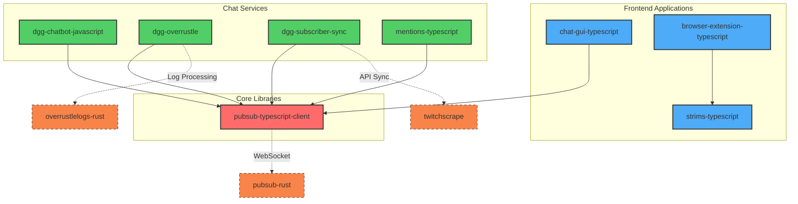

# TypeScript Components Coverage

[[../Twitch Docs/Index]] | [[../rust-components/Coverage]] | [[../Changelog]]

## Overview
Documentation coverage for TypeScript/JavaScript-based repositories in the Surrentumlabs ecosystem. This covers 8 TypeScript component repositories with various completion statuses.

## Component Checklist

| Component | Type | Source Path | Status | Last Scanned | Doc File | Backlinks |
|-----------|------|-------------|--------|--------------|----------|-----------|
| browser-extension-typescript | repo | /home/cinder/Documents/repos/Surrentumlabs/Typescript Component Repos/browser-extension-typescript | todo | 2025-01-26 | - | [[../Twitch Docs/Index]] |
| chat-gui-typescript | repo | /home/cinder/Documents/repos/Surrentumlabs/Typescript Component Repos/chat-gui-typescript | todo | 2025-01-26 | - | [[../Twitch Docs/Index]] |
| dgg-chatbot-javascript | repo | /home/cinder/Documents/repos/Surrentumlabs/Typescript Component Repos/dgg-chatbot-javascript | todo | 2025-01-26 | - | [[../Twitch Docs/Index]] |
| dgg-overrustle | repo | /home/cinder/Documents/repos/Surrentumlabs/Typescript Component Repos/dgg-overrustle | todo | 2025-01-26 | - | [[../Twitch Docs/Index]] |
| dgg-subscriber-sync | repo | /home/cinder/Documents/repos/Surrentumlabs/Typescript Component Repos/dgg-subscriber-sync | todo | 2025-01-26 | - | [[../Twitch Docs/Index]] |
| mentions-typescript | repo | /home/cinder/Documents/repos/Surrentumlabs/Typescript Component Repos/mentions-typescript | todo | 2025-01-26 | - | [[../Twitch Docs/Index]] |
| pubsub-typescript-client | repo | /home/cinder/Documents/repos/Surrentumlabs/Typescript Component Repos/pubsub-typescript-client | todo | 2025-01-26 | - | [[../Twitch Docs/Index]] |
| strims-typescript | repo | /home/cinder/Documents/repos/Surrentumlabs/Typescript Component Repos/strims-typescript | todo | 2025-01-26 | - | [[../Twitch Docs/Index]] |

## TypeScript Dependency Matrix

## Summary
- **Total TypeScript Repositories**: 8
- **Documentation Status**: All todo (0% complete)
- **Primary Categories**: Frontend Applications (3), Chat Services (4), Core Libraries (1)
- **Key Dependencies**: pubsub-typescript-client as central client library
- **Cross-Ecosystem**: Multiple connections to Rust components via APIs and WebSocket

## Architecture Notes
- **pubsub-typescript-client**: Core WebSocket client library used across multiple services
- **dgg-overrustle**: Mixed TypeScript/Rust repository with Rust backend, TypeScript utilities
- **dgg-subscriber-sync**: Mixed TypeScript/Rust repository with Rust core, TypeScript integrations
- **Frontend Stack**: Modern TypeScript with React/Angular components and webpack bundling
- **Chat Integration**: All chat services depend on PubSub for real-time messaging

## Next Steps
1. Prioritize core library documentation (pubsub-typescript-client)
2. Document frontend applications and their component architecture
3. Map actual dependencies from package.json files
4. Create detailed Component Cards for each repository
5. Document TypeScript/Rust integration patterns
6. Update status tracking as documentation progresses

---
*Last updated: 2025-01-26 | Backlinks: [[../Twitch Docs/Index]] | [[../rust-components/Coverage]] | [[../Changelog]]*
